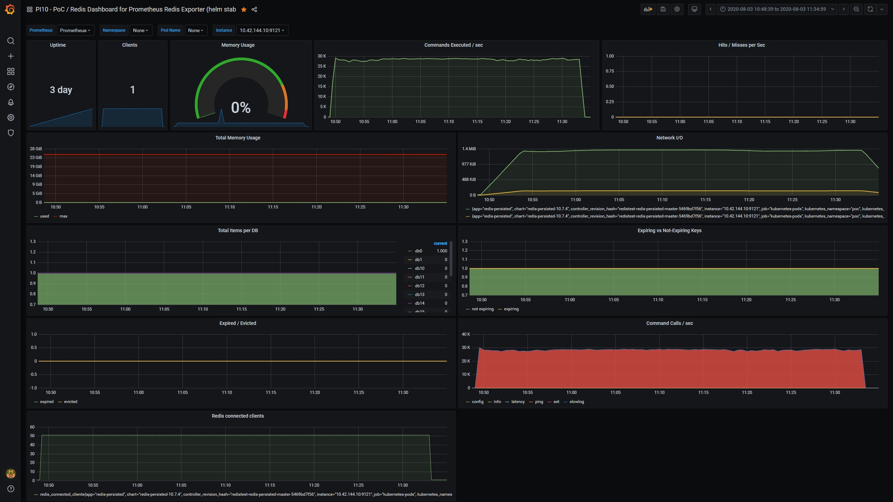

- [Redis](#redis)
- [General tests on i3.xlarge (local redis)](#general-tests-on-i3xlarge-local-redis)
- [75M requests of SET (>25 minutes)](#75m-requests-of-set-25-minutes)
  - [Local: Benchmark code hits local redis](#local-benchmark-code-hits-local-redis)
    - [i3.xlarge with SSD mounted](#i3xlarge-with-ssd-mounted)
    - [i3.xlarge without SSD mounted (so EBS filesystem)](#i3xlarge-without-ssd-mounted-so-ebs-filesystem)
    - [i3.2xlarge with SSD mounted](#i32xlarge-with-ssd-mounted)
    - [i3.4xlarge with SSD mounted](#i34xlarge-with-ssd-mounted)
    - [r5.xlarge - 25M requests (short test)](#r5xlarge---25m-requests-short-test)
    - [r5.xlarge - 75M requests (long test)](#r5xlarge---75m-requests-long-test)
    - [c5.xlarge - 25M requests (short test)](#c5xlarge---25m-requests-short-test)
  - [Network: Benchmark code hits remote redis](#network-benchmark-code-hits-remote-redis)
    - [i3.xlarge hitting another i3.xlarge with SSD mounted](#i3xlarge-hitting-another-i3xlarge-with-ssd-mounted)
  - [Summary table](#summary-table)
- [Single client (parallellism off)](#single-client-parallellism-off)
  - [Single client: Network vs local](#single-client-network-vs-local)
    - [Single client: Redis by Network (i3.xlarge)](#single-client-redis-by-network-i3xlarge)
    - [Single client: Redis by local (i3.xlarge)](#single-client-redis-by-local-i3xlarge)
    - [Single client: Redis by Network (i3.xlarge) - 3k data](#single-client-redis-by-network-i3xlarge---3k-data)
    - [Single client: Redis by local (i3.xlarge) - 3k data](#single-client-redis-by-local-i3xlarge---3k-data)
    - [Single client: Redis by local (r5.xlarge)](#single-client-redis-by-local-r5xlarge)
    - [Single client: Redis by local (c5.xlarge)](#single-client-redis-by-local-c5xlarge)
    - [Single client: Summary table](#single-client-summary-table)

# Redis

Running tests according to https://redis.io/topics/benchmarks
- default tests do 3 bytes of data
- those benchmarks run the code of https://github.com/redis/redis/blob/unstable/src/redis-benchmark.c

# General tests on i3.xlarge (local redis)
"local redis" means that the benchmark script is inside of the same docker the Redis server resides.

- 1 [Redis i3.xlarge](runs/redis-benchmark_local_i3.xlarge_everysec_persisted.md) - filesystem on EBS - persistence: everysec
- 2 [Redis i3.xlarge](runs/redis-benchmark_local_i3.xlarge_everysec_persisted_ssd.md) - filesystem on SSD - persistence: everysec

- 3 [Redis i3.xlarge](runs/redis-benchmark_local_i3.xlarge_always_persisted.md) - filesystem on EBS - persistence: always
- 4 [Redis i3.xlarge](runs/redis-benchmark_local_i3.xlarge_always_persisted_ssd.md) - filesystem on SSD - persistence: always

| | 1 | 2 | 3 | 4  |
| --- | --- | --- | --- | --- |
| | EBS | SSD | EBS | SSD |
| | everysec | everysec | always | always |
| Test # | req/s | req/s | req/s | req/s |
| 1 Default benchmark PING (100k requests) | 82850 | 58858 | 79681 | 63897 |
| 1 Default benchmark SET (100k requests) | 77821 | 66844 | 15812 | 48614 |
| 1 Default benchmark GET (100k requests) | 79239 | 62617 | 83194 | 67659 |
| 2 1M requests (default) PING | 81906 | 62046 | 82331 | 64632 |
| 2 1M requests (default) SET | 83465 | 67249 | 15918 | 49667 |
| 2 1M requests (default) GET | 81473 | 62433 | 82169 | 62680 |
| 3 SET (1M) | 83738 | 66085 | 15906 | 51332 |
| 4 SET with random key | 81419 | 65500 | 15970 | 49084 |
| 5 SET through LUA script (vs run #3 - no significant diff) | 83263 | 67145 | 14869 | 49275 |
| 6 SET (LUA) with participant-like key and 30 bytes data | 80534 | 64884 | 14972 | 47272 |
| 7 SET (LUA) with participant-like key and 300 bytes data | 76283 | 64094 | 14249 | 44800 |
| 8 SET (LUA) with participant-like key and 300 bytes data | 23822 | 33308 | 9774 | 25445 |
| 9 SET with random key and 3000 bytes data | 42879 | 45228 | 30296 | 30296 |

Comment: When testing "everysec" scenario, the EBS provisioned machine reports better results than SSD one. This looks strange, so to re-check, we provisioned new i3.xlarge machine, did the SET (1M) test, then switched that machine to SSD and did the SET (1M) again. This confirmed those results displayed in the table above (so it's not a straightforward error/mistake and data is valid). We didn't investigate that further yet, but that needs some more understanding probably.

# 75M requests of SET (>25 minutes)
All tests below made with default redis-benchmark config (unless stated otherwise):
- 50 parallel clients
- 3 bytes payload

## Local: Benchmark code hits local redis

### i3.xlarge with SSD mounted
```
$ redis-benchmark -t set -n 75000000
====== SET ======
  75000000 requests completed in 1461.30 seconds
  50 parallel clients
  3 bytes payload
  keep alive: 1
  host configuration "save":
  host configuration "appendonly": yes
  multi-thread: no

0.00% <= 0.2 milliseconds
0.00% <= 0.3 milliseconds
0.01% <= 0.4 milliseconds
0.21% <= 0.5 milliseconds
1.56% <= 0.6 milliseconds
20.75% <= 0.7 milliseconds
44.15% <= 0.8 milliseconds
62.52% <= 0.9 milliseconds
78.52% <= 1.0 milliseconds
90.32% <= 1.1 milliseconds
94.86% <= 1.2 milliseconds
96.86% <= 1.3 milliseconds
98.39% <= 1.4 milliseconds
98.90% <= 1.5 milliseconds
99.08% <= 1.6 milliseconds
99.19% <= 1.7 milliseconds
99.26% <= 1.8 milliseconds
99.33% <= 1.9 milliseconds
99.40% <= 2 milliseconds
99.93% <= 3 milliseconds
99.97% <= 4 milliseconds
99.98% <= 5 milliseconds
99.98% <= 6 milliseconds
99.99% <= 7 milliseconds
99.99% <= 8 milliseconds
99.99% <= 9 milliseconds
100.00% <= 10 milliseconds
100.00% <= 11 milliseconds
100.00% <= 12 milliseconds
100.00% <= 13 milliseconds
100.00% <= 14 milliseconds
100.00% <= 15 milliseconds
100.00% <= 16 milliseconds
100.00% <= 19 milliseconds
100.00% <= 25 milliseconds
100.00% <= 26 milliseconds
100.00% <= 26 milliseconds
51324.20 requests per second
```
[](runs/redis_long_set_local_i3.xlarge_always_persisted_ssd_grafana.jpg)

### i3.xlarge without SSD mounted (so EBS filesystem)

```
redis-benchmark -t set -n 75000000
====== SET ======
  75000000 requests completed in 6911.88 seconds
  50 parallel clients
  3 bytes payload
  keep alive: 1
  host configuration "save":
  host configuration "appendonly": yes
  multi-thread: no

0.00% <= 1.4 milliseconds
0.00% <= 1.5 milliseconds
0.00% <= 1.6 milliseconds
0.00% <= 1.7 milliseconds
0.41% <= 1.8 milliseconds
4.46% <= 1.9 milliseconds
12.44% <= 2 milliseconds
29.01% <= 3 milliseconds
82.30% <= 4 milliseconds
87.88% <= 5 milliseconds
88.51% <= 6 milliseconds
88.71% <= 7 milliseconds
88.82% <= 8 milliseconds
88.89% <= 9 milliseconds
89.10% <= 10 milliseconds
93.61% <= 11 milliseconds
93.64% <= 12 milliseconds
93.65% <= 13 milliseconds
93.67% <= 14 milliseconds
93.69% <= 15 milliseconds
93.70% <= 16 milliseconds
93.71% <= 17 milliseconds
93.72% <= 18 milliseconds
93.74% <= 19 milliseconds
99.65% <= 20 milliseconds
99.95% <= 21 milliseconds
99.96% <= 22 milliseconds
99.97% <= 23 milliseconds
99.98% <= 24 milliseconds
99.99% <= 25 milliseconds
99.99% <= 26 milliseconds
99.99% <= 27 milliseconds
99.99% <= 28 milliseconds
99.99% <= 29 milliseconds
99.99% <= 30 milliseconds
100.00% <= 31 milliseconds
100.00% <= 32 milliseconds
100.00% <= 33 milliseconds
100.00% <= 34 milliseconds
100.00% <= 35 milliseconds
100.00% <= 36 milliseconds
100.00% <= 37 milliseconds
100.00% <= 38 milliseconds
100.00% <= 39 milliseconds
100.00% <= 40 milliseconds
100.00% <= 41 milliseconds
100.00% <= 42 milliseconds
100.00% <= 43 milliseconds
100.00% <= 44 milliseconds
100.00% <= 45 milliseconds
100.00% <= 46 milliseconds
100.00% <= 49 milliseconds
100.00% <= 50 milliseconds
100.00% <= 51 milliseconds
100.00% <= 52 milliseconds
100.00% <= 53 milliseconds
100.00% <= 56 milliseconds
100.00% <= 59 milliseconds
100.00% <= 60 milliseconds
100.00% <= 62 milliseconds
100.00% <= 63 milliseconds
100.00% <= 66 milliseconds
100.00% <= 66 milliseconds
10850.88 requests per second
```
[](runs/redis_long_set_local_i3.xlarge_always_persisted_ebs_grafana.jpg)

### i3.2xlarge with SSD mounted
```
redis-benchmark -t set -n 75000000
====== SET ======
  75000000 requests completed in 1337.99 seconds
  50 parallel clients
  3 bytes payload
  keep alive: 1
  host configuration "save":
  host configuration "appendonly": yes
  multi-thread: no

0.00% <= 0.2 milliseconds
0.00% <= 0.3 milliseconds
0.02% <= 0.4 milliseconds
0.30% <= 0.5 milliseconds
3.85% <= 0.6 milliseconds
36.13% <= 0.7 milliseconds
58.63% <= 0.8 milliseconds
75.09% <= 0.9 milliseconds
89.07% <= 1.0 milliseconds
97.13% <= 1.1 milliseconds
98.54% <= 1.2 milliseconds
99.30% <= 1.3 milliseconds
99.85% <= 1.4 milliseconds
99.93% <= 1.5 milliseconds
99.94% <= 1.6 milliseconds
99.95% <= 1.7 milliseconds
99.96% <= 1.8 milliseconds
99.96% <= 1.9 milliseconds
99.97% <= 2 milliseconds
99.99% <= 3 milliseconds
99.99% <= 4 milliseconds
100.00% <= 5 milliseconds
100.00% <= 6 milliseconds
100.00% <= 7 milliseconds
100.00% <= 8 milliseconds
100.00% <= 9 milliseconds
100.00% <= 9 milliseconds
56054.02 requests per second
```
[](runs/redis_long_set_local_i3.2xlarge_always_persisted_ssd_grafana.jpg)

### i3.4xlarge with SSD mounted
```
$ redis-benchmark -t set -n 75000000
====== SET ======
  75000000 requests completed in 1323.25 seconds
  50 parallel clients
  3 bytes payload
  keep alive: 1
  host configuration "save":
  host configuration "appendonly": yes
  multi-thread: no

0.00% <= 0.2 milliseconds
0.00% <= 0.3 milliseconds
0.03% <= 0.4 milliseconds
0.31% <= 0.5 milliseconds
3.04% <= 0.6 milliseconds
36.61% <= 0.7 milliseconds
60.77% <= 0.8 milliseconds
77.02% <= 0.9 milliseconds
90.13% <= 1.0 milliseconds
98.40% <= 1.1 milliseconds
99.42% <= 1.2 milliseconds
99.74% <= 1.3 milliseconds
99.93% <= 1.4 milliseconds
99.97% <= 1.5 milliseconds
99.98% <= 1.6 milliseconds
99.98% <= 1.7 milliseconds
99.98% <= 1.8 milliseconds
99.99% <= 1.9 milliseconds
99.99% <= 2 milliseconds
100.00% <= 3 milliseconds
100.00% <= 4 milliseconds
100.00% <= 5 milliseconds
100.00% <= 6 milliseconds
100.00% <= 7 milliseconds
100.00% <= 9 milliseconds
100.00% <= 10 milliseconds
100.00% <= 11 milliseconds
100.00% <= 11 milliseconds
56678.68 requests per second
```
[](runs/redis_long_set_local_i3.4xlarge_always_persisted_ssd_grafana.jpg)

### r5.xlarge - 25M requests (short test)
This test is 25M requests only, to make sure it doesn't hit any IOPS budget limits on AWS.
```
redis-benchmark -t set -n 25000000
====== SET ======
  25000000 requests completed in 1439.63 seconds
  50 parallel clients
  3 bytes payload
  keep alive: 1
  host configuration "save":
  host configuration "appendonly": yes
  multi-thread: no

0.00% <= 1.3 milliseconds
0.00% <= 1.4 milliseconds
0.00% <= 1.5 milliseconds
0.21% <= 1.6 milliseconds
4.17% <= 1.7 milliseconds
13.97% <= 1.8 milliseconds
24.08% <= 1.9 milliseconds
31.64% <= 2 milliseconds
42.08% <= 3 milliseconds
97.75% <= 4 milliseconds
98.59% <= 5 milliseconds
99.09% <= 6 milliseconds
99.43% <= 7 milliseconds
99.65% <= 8 milliseconds
99.79% <= 9 milliseconds
99.87% <= 10 milliseconds
99.92% <= 11 milliseconds
99.95% <= 12 milliseconds
99.97% <= 13 milliseconds
99.98% <= 14 milliseconds
99.99% <= 15 milliseconds
99.99% <= 16 milliseconds
99.99% <= 17 milliseconds
100.00% <= 18 milliseconds
100.00% <= 19 milliseconds
100.00% <= 20 milliseconds
100.00% <= 21 milliseconds
100.00% <= 22 milliseconds
100.00% <= 23 milliseconds
100.00% <= 24 milliseconds
100.00% <= 25 milliseconds
100.00% <= 26 milliseconds
100.00% <= 27 milliseconds
100.00% <= 28 milliseconds
100.00% <= 30 milliseconds
100.00% <= 31 milliseconds
100.00% <= 34 milliseconds
100.00% <= 35 milliseconds
100.00% <= 35 milliseconds
17365.54 requests per second
```
[](runs/redis_long_set_local_r5.xlarge_always_persisted_grafana_25M.jpg)

### r5.xlarge - 75M requests (long test)
This test is 75M requests.

Note: The "3443.05 requests per second" average number of transactions doesn't show the full story, as the run did hit the AWS limit of IOPS. There are 2 distinct parts of this run:
- around 40 minutes at ~16k req/s
- then AWS budget for IOPS hit 0 and disk access got throttled, so redis does 1.8k req/s
- both redis-graffana chart and AWS budget chart attached,

```
redis-benchmark -t set -n 75000000
====== SET ======
  75000000 requests completed in 21782.98 seconds
  50 parallel clients
  3 bytes payload
  keep alive: 1
  host configuration "save":
  host configuration "appendonly": yes
  multi-thread: no

0.00% <= 1.3 milliseconds
0.00% <= 1.4 milliseconds
0.00% <= 1.5 milliseconds
0.00% <= 1.6 milliseconds
0.10% <= 1.7 milliseconds
2.12% <= 1.8 milliseconds
7.85% <= 1.9 milliseconds
12.50% <= 2 milliseconds
21.62% <= 3 milliseconds
51.02% <= 4 milliseconds
52.43% <= 5 milliseconds
52.77% <= 6 milliseconds
53.13% <= 7 milliseconds
53.34% <= 8 milliseconds
53.45% <= 9 milliseconds
53.51% <= 10 milliseconds
53.56% <= 11 milliseconds
53.60% <= 12 milliseconds
53.63% <= 13 milliseconds
64.38% <= 14 milliseconds
64.41% <= 15 milliseconds
64.43% <= 16 milliseconds
64.50% <= 17 milliseconds
64.51% <= 18 milliseconds
64.52% <= 19 milliseconds
64.53% <= 20 milliseconds
64.67% <= 21 milliseconds
64.68% <= 22 milliseconds
64.70% <= 23 milliseconds
71.53% <= 24 milliseconds
71.56% <= 25 milliseconds
71.59% <= 26 milliseconds
78.02% <= 27 milliseconds
78.04% <= 28 milliseconds
78.05% <= 29 milliseconds
78.12% <= 30 milliseconds
78.15% <= 31 milliseconds
78.16% <= 32 milliseconds
78.22% <= 33 milliseconds
78.59% <= 34 milliseconds
78.63% <= 35 milliseconds
78.69% <= 36 milliseconds
99.57% <= 37 milliseconds
99.62% <= 38 milliseconds
99.65% <= 39 milliseconds
99.86% <= 40 milliseconds
99.88% <= 41 milliseconds
99.89% <= 42 milliseconds
99.90% <= 43 milliseconds
99.93% <= 44 milliseconds
99.93% <= 45 milliseconds
99.93% <= 46 milliseconds
99.95% <= 47 milliseconds
99.95% <= 48 milliseconds
99.95% <= 49 milliseconds
99.96% <= 50 milliseconds
99.96% <= 51 milliseconds
99.96% <= 52 milliseconds
99.96% <= 53 milliseconds
99.97% <= 54 milliseconds
99.97% <= 55 milliseconds
99.97% <= 56 milliseconds
99.98% <= 57 milliseconds
99.98% <= 58 milliseconds
99.98% <= 59 milliseconds
99.98% <= 60 milliseconds
99.98% <= 61 milliseconds
99.98% <= 62 milliseconds
99.98% <= 63 milliseconds
99.99% <= 64 milliseconds
99.99% <= 65 milliseconds
99.99% <= 66 milliseconds
99.99% <= 67 milliseconds
99.99% <= 68 milliseconds
99.99% <= 69 milliseconds
99.99% <= 70 milliseconds
99.99% <= 71 milliseconds
99.99% <= 72 milliseconds
99.99% <= 73 milliseconds
99.99% <= 74 milliseconds
99.99% <= 76 milliseconds
100.00% <= 79 milliseconds
100.00% <= 80 milliseconds
100.00% <= 82 milliseconds
100.00% <= 83 milliseconds
100.00% <= 86 milliseconds
100.00% <= 87 milliseconds
100.00% <= 89 milliseconds
100.00% <= 90 milliseconds
100.00% <= 92 milliseconds
100.00% <= 93 milliseconds
100.00% <= 94 milliseconds
100.00% <= 95 milliseconds
100.00% <= 96 milliseconds
100.00% <= 99 milliseconds
100.00% <= 100 milliseconds
100.00% <= 102 milliseconds
100.00% <= 103 milliseconds
100.00% <= 106 milliseconds
100.00% <= 109 milliseconds
100.00% <= 110 milliseconds
100.00% <= 112 milliseconds
100.00% <= 113 milliseconds
100.00% <= 116 milliseconds
100.00% <= 119 milliseconds
100.00% <= 120 milliseconds
100.00% <= 121 milliseconds
100.00% <= 122 milliseconds
100.00% <= 123 milliseconds
100.00% <= 126 milliseconds
100.00% <= 129 milliseconds
100.00% <= 130 milliseconds
100.00% <= 132 milliseconds
100.00% <= 133 milliseconds
100.00% <= 136 milliseconds
100.00% <= 137 milliseconds
100.00% <= 139 milliseconds
100.00% <= 140 milliseconds
100.00% <= 143 milliseconds
100.00% <= 146 milliseconds
100.00% <= 149 milliseconds
100.00% <= 150 milliseconds
100.00% <= 152 milliseconds
100.00% <= 153 milliseconds
100.00% <= 159 milliseconds
100.00% <= 160 milliseconds
100.00% <= 169 milliseconds
100.00% <= 172 milliseconds
100.00% <= 173 milliseconds
100.00% <= 179 milliseconds
100.00% <= 180 milliseconds
100.00% <= 189 milliseconds
100.00% <= 193 milliseconds
100.00% <= 202 milliseconds
100.00% <= 203 milliseconds
100.00% <= 209 milliseconds
100.00% <= 210 milliseconds
100.00% <= 216 milliseconds
100.00% <= 229 milliseconds
100.00% <= 230 milliseconds
100.00% <= 236 milliseconds
100.00% <= 237 milliseconds
100.00% <= 245 milliseconds
100.00% <= 246 milliseconds
100.00% <= 249 milliseconds
100.00% <= 250 milliseconds
100.00% <= 252 milliseconds
100.00% <= 253 milliseconds
100.00% <= 267 milliseconds
100.00% <= 268 milliseconds
100.00% <= 283 milliseconds
100.00% <= 373 milliseconds
100.00% <= 492 milliseconds
100.00% <= 493 milliseconds
100.00% <= 494 milliseconds
100.00% <= 494 milliseconds
3443.05 requests per second
```

Whole run:
[](runs/redis_long_set_local_r5.xlarge_always_persisted_grafana_75M.jpg)

1st part of the run (before IOPS limit):
[](runs/redis_long_set_local_r5.xlarge_always_persisted_grafana_75M_1.jpg)

2nd part of the run (after IOPS limit):
[](runs/redis_long_set_local_r5.xlarge_always_persisted_grafana_75M_2.jpg)

AWS Volume Burst balance:
[](runs/redis_long_set_local_r5.xlarge_always_persisted_aws_75M.jpg)


### c5.xlarge - 25M requests (short test)
This test is 25M requests only, to make sure it doesn't hit any IOPS budget limits on AWS.
```
redis-benchmark -t set -n 25000000
====== SET ======
  25000000 requests completed in 1385.79 seconds
  50 parallel clients
  3 bytes payload
  keep alive: 1
  host configuration "save":
  host configuration "appendonly": yes
  multi-thread: no

0.00% <= 1.2 milliseconds
0.00% <= 1.3 milliseconds
0.00% <= 1.4 milliseconds
0.02% <= 1.5 milliseconds
1.23% <= 1.6 milliseconds
8.45% <= 1.7 milliseconds
19.52% <= 1.8 milliseconds
30.39% <= 1.9 milliseconds
36.95% <= 2 milliseconds
46.70% <= 3 milliseconds
97.68% <= 4 milliseconds
98.46% <= 5 milliseconds
99.16% <= 6 milliseconds
99.62% <= 7 milliseconds
99.79% <= 8 milliseconds
99.88% <= 9 milliseconds
99.93% <= 10 milliseconds
99.96% <= 11 milliseconds
99.98% <= 12 milliseconds
99.99% <= 13 milliseconds
99.99% <= 14 milliseconds
99.99% <= 15 milliseconds
100.00% <= 16 milliseconds
100.00% <= 17 milliseconds
100.00% <= 18 milliseconds
100.00% <= 19 milliseconds
100.00% <= 20 milliseconds
100.00% <= 21 milliseconds
100.00% <= 22 milliseconds
100.00% <= 23 milliseconds
100.00% <= 24 milliseconds
100.00% <= 25 milliseconds
100.00% <= 27 milliseconds
100.00% <= 28 milliseconds
100.00% <= 29 milliseconds
100.00% <= 33 milliseconds
100.00% <= 36 milliseconds
100.00% <= 41 milliseconds
100.00% <= 41 milliseconds
18040.21 requests per second
```

[](runs/redis_long_set_local_c5.xlarge_always_persisted_grafana_25M.jpg)

## Network: Benchmark code hits remote redis

### i3.xlarge hitting another i3.xlarge with SSD mounted

Test `redis-benchmark` runs on i3.xlarge (inside of redis container) and hits redis (through network) hosted on another i3.xlarge machine:
```
redis-benchmark -h 10.42.144.10 -t set -n 75000000
====== SET ======
  75000000 requests completed in 2642.50 seconds
  50 parallel clients
  3 bytes payload
  keep alive: 1
  host configuration "save":
  host configuration "appendonly": yes
  multi-thread: no

0.00% <= 0.4 milliseconds
0.00% <= 0.5 milliseconds
0.02% <= 0.6 milliseconds
0.23% <= 0.7 milliseconds
0.89% <= 0.8 milliseconds
2.24% <= 0.9 milliseconds
4.72% <= 1.0 milliseconds
8.70% <= 1.1 milliseconds
14.78% <= 1.2 milliseconds
22.92% <= 1.3 milliseconds
32.22% <= 1.4 milliseconds
42.13% <= 1.5 milliseconds
52.75% <= 1.6 milliseconds
64.28% <= 1.7 milliseconds
75.15% <= 1.8 milliseconds
83.17% <= 1.9 milliseconds
88.05% <= 2 milliseconds
99.72% <= 3 milliseconds
99.86% <= 4 milliseconds
99.90% <= 5 milliseconds
99.92% <= 6 milliseconds
99.93% <= 7 milliseconds
99.95% <= 8 milliseconds
99.96% <= 9 milliseconds
99.97% <= 10 milliseconds
99.97% <= 11 milliseconds
99.98% <= 12 milliseconds
99.98% <= 13 milliseconds
99.98% <= 14 milliseconds
99.98% <= 15 milliseconds
99.98% <= 16 milliseconds
99.98% <= 17 milliseconds
99.98% <= 18 milliseconds
99.99% <= 19 milliseconds
99.99% <= 20 milliseconds
99.99% <= 21 milliseconds
99.99% <= 22 milliseconds
99.99% <= 23 milliseconds
99.99% <= 24 milliseconds
99.99% <= 25 milliseconds
99.99% <= 26 milliseconds
99.99% <= 27 milliseconds
99.99% <= 28 milliseconds
99.99% <= 29 milliseconds
99.99% <= 30 milliseconds
99.99% <= 31 milliseconds
99.99% <= 32 milliseconds
99.99% <= 33 milliseconds
99.99% <= 34 milliseconds
99.99% <= 35 milliseconds
99.99% <= 36 milliseconds
99.99% <= 37 milliseconds
99.99% <= 38 milliseconds
99.99% <= 39 milliseconds
99.99% <= 40 milliseconds
99.99% <= 41 milliseconds
99.99% <= 42 milliseconds
99.99% <= 43 milliseconds
99.99% <= 44 milliseconds
99.99% <= 45 milliseconds
99.99% <= 46 milliseconds
99.99% <= 47 milliseconds
99.99% <= 48 milliseconds
99.99% <= 49 milliseconds
99.99% <= 50 milliseconds
99.99% <= 51 milliseconds
99.99% <= 52 milliseconds
99.99% <= 53 milliseconds
99.99% <= 54 milliseconds
100.00% <= 55 milliseconds
100.00% <= 56 milliseconds
100.00% <= 57 milliseconds
100.00% <= 58 milliseconds
100.00% <= 59 milliseconds
100.00% <= 60 milliseconds
100.00% <= 61 milliseconds
100.00% <= 62 milliseconds
100.00% <= 63 milliseconds
100.00% <= 64 milliseconds
100.00% <= 65 milliseconds
100.00% <= 66 milliseconds
100.00% <= 67 milliseconds
100.00% <= 68 milliseconds
100.00% <= 69 milliseconds
100.00% <= 70 milliseconds
100.00% <= 71 milliseconds
100.00% <= 72 milliseconds
100.00% <= 73 milliseconds
100.00% <= 74 milliseconds
100.00% <= 75 milliseconds
100.00% <= 76 milliseconds
100.00% <= 77 milliseconds
100.00% <= 78 milliseconds
100.00% <= 79 milliseconds
100.00% <= 80 milliseconds
100.00% <= 81 milliseconds
100.00% <= 82 milliseconds
100.00% <= 83 milliseconds
100.00% <= 84 milliseconds
100.00% <= 85 milliseconds
100.00% <= 86 milliseconds
100.00% <= 87 milliseconds
100.00% <= 88 milliseconds
100.00% <= 89 milliseconds
100.00% <= 90 milliseconds
100.00% <= 91 milliseconds
28382.21 requests per second
```

[](runs/redis_long_set_network_i3.xlarge_always_persisted_ssd_grafana.jpg)

## Summary table

| Test | Requests/s |
| --- |  --- |
| Local: i3.xlarge with SSD mounted | 51324 |
| Local: i3.xlarge without SSD mounted (so EBS filesystem)| 10850 |
| Local: i3.2xlarge with SSD mounted | 56054 |
| Local: i3.4xlarge with SSD mounted | 56678 |
| Local: r5.xlarge - 25M requests (short test) | 17365 |
| Local: r5.xlarge - 75M requests (long test 1st phase) | 16-17k |
| Local: r5.xlarge - 75M requests (long test 2nd phase) | 1.8k |
| Local: c5.xlarge - 25M requests (short test) | 18040 |
| Network: i3.xlarge hitting another i3.xlarge | 28382 |


# Single client (parallellism off)

## Single client: Network vs local
### Single client: Redis by Network (i3.xlarge)
redis-benchmark on i3.xlarge hits redis on i3.xlarge with SSD mounted

```
redis-benchmark -h 10.42.144.10 -t set -n 3000000 -c 1
====== SET ======
  3000000 requests completed in 1182.69 seconds
  1 parallel clients
  3 bytes payload
  keep alive: 1
  host configuration "save":
  host configuration "appendonly": yes
  multi-thread: no

0.00% <= 0.3 milliseconds
87.23% <= 0.4 milliseconds
99.06% <= 0.5 milliseconds
99.52% <= 0.6 milliseconds
99.63% <= 0.7 milliseconds
99.68% <= 0.8 milliseconds
99.71% <= 0.9 milliseconds
99.75% <= 1.0 milliseconds
99.79% <= 1.1 milliseconds
99.83% <= 1.2 milliseconds
99.86% <= 1.3 milliseconds
99.87% <= 1.4 milliseconds
99.89% <= 1.5 milliseconds
99.89% <= 1.6 milliseconds
99.90% <= 1.7 milliseconds
99.91% <= 1.8 milliseconds
99.91% <= 1.9 milliseconds
99.92% <= 2 milliseconds
99.94% <= 3 milliseconds
99.95% <= 4 milliseconds
99.96% <= 5 milliseconds
99.97% <= 6 milliseconds
99.97% <= 7 milliseconds
99.97% <= 8 milliseconds
99.98% <= 9 milliseconds
99.98% <= 10 milliseconds
99.98% <= 11 milliseconds
99.98% <= 12 milliseconds
99.98% <= 13 milliseconds
99.98% <= 14 milliseconds
99.98% <= 15 milliseconds
99.98% <= 16 milliseconds
99.98% <= 17 milliseconds
99.99% <= 18 milliseconds
99.99% <= 19 milliseconds
99.99% <= 20 milliseconds
99.99% <= 21 milliseconds
99.99% <= 22 milliseconds
99.99% <= 23 milliseconds
99.99% <= 24 milliseconds
99.99% <= 25 milliseconds
99.99% <= 26 milliseconds
99.99% <= 27 milliseconds
99.99% <= 28 milliseconds
99.99% <= 29 milliseconds
99.99% <= 30 milliseconds
99.99% <= 31 milliseconds
99.99% <= 32 milliseconds
99.99% <= 33 milliseconds
99.99% <= 34 milliseconds
100.00% <= 35 milliseconds
100.00% <= 36 milliseconds
100.00% <= 37 milliseconds
100.00% <= 38 milliseconds
100.00% <= 39 milliseconds
100.00% <= 40 milliseconds
100.00% <= 41 milliseconds
100.00% <= 42 milliseconds
100.00% <= 43 milliseconds
100.00% <= 44 milliseconds
100.00% <= 46 milliseconds
100.00% <= 47 milliseconds
2536.59 requests per second
```

[](runs/redis_long_set_network_single_client_i3.xlarge_always_persisted_ssd_grafana.jpg)


### Single client: Redis by local (i3.xlarge)
redis-benchmark on i3.xlarge (SSD mounted) hits local redis

```
redis-benchmark -t set -n 3000000 -c 1
====== SET ======
  3000000 requests completed in 809.94 seconds
  1 parallel clients
  3 bytes payload
  keep alive: 1
  host configuration "save":
  host configuration "appendonly": yes
  multi-thread: no

0.00% <= 0.2 milliseconds
96.48% <= 0.3 milliseconds
99.55% <= 0.4 milliseconds
99.69% <= 0.5 milliseconds
99.74% <= 0.6 milliseconds
99.77% <= 0.7 milliseconds
99.79% <= 0.8 milliseconds
99.82% <= 0.9 milliseconds
99.85% <= 1.0 milliseconds
99.88% <= 1.1 milliseconds
99.90% <= 1.2 milliseconds
99.92% <= 1.3 milliseconds
99.93% <= 1.4 milliseconds
99.94% <= 1.5 milliseconds
99.94% <= 1.6 milliseconds
99.95% <= 1.7 milliseconds
99.95% <= 1.8 milliseconds
99.96% <= 1.9 milliseconds
99.96% <= 2 milliseconds
99.98% <= 3 milliseconds
99.98% <= 4 milliseconds
99.99% <= 5 milliseconds
99.99% <= 6 milliseconds
99.99% <= 7 milliseconds
99.99% <= 8 milliseconds
100.00% <= 9 milliseconds
100.00% <= 10 milliseconds
100.00% <= 11 milliseconds
100.00% <= 12 milliseconds
100.00% <= 13 milliseconds
100.00% <= 14 milliseconds
100.00% <= 15 milliseconds
100.00% <= 16 milliseconds
100.00% <= 17 milliseconds
100.00% <= 18 milliseconds
100.00% <= 19 milliseconds
100.00% <= 22 milliseconds
100.00% <= 24 milliseconds
100.00% <= 25 milliseconds
100.00% <= 26 milliseconds
100.00% <= 27 milliseconds
100.00% <= 28 milliseconds
100.00% <= 29 milliseconds
100.00% <= 30 milliseconds
100.00% <= 31 milliseconds
100.00% <= 32 milliseconds
100.00% <= 33 milliseconds
100.00% <= 34 milliseconds
100.00% <= 35 milliseconds
100.00% <= 36 milliseconds
100.00% <= 37 milliseconds
100.00% <= 38 milliseconds
100.00% <= 39 milliseconds
100.00% <= 40 milliseconds
100.00% <= 41 milliseconds
100.00% <= 43 milliseconds
3703.98 requests per second
```
[](runs/redis_long_set_local_single_client_i3.xlarge_always_persisted_ssd_grafana.jpg)


### Single client: Redis by Network (i3.xlarge) - 3k data
redis-benchmark on i3.xlarge hits 3k data commands redis on i3.xlarge with SSD mounted

```
redis-benchmark -h 10.42.144.10 -t set -n 3000000 -c 1 -r 10000 -d 3000
====== SET ======
  3000000 requests completed in 1416.97 seconds
  1 parallel clients
  3000 bytes payload
  keep alive: 1
  host configuration "save":
  host configuration "appendonly": yes
  multi-thread: no

0.00% <= 0.3 milliseconds
1.84% <= 0.4 milliseconds
91.74% <= 0.5 milliseconds
99.06% <= 0.6 milliseconds
99.46% <= 0.7 milliseconds
99.57% <= 0.8 milliseconds
99.63% <= 0.9 milliseconds
99.67% <= 1.0 milliseconds
99.71% <= 1.1 milliseconds
99.76% <= 1.2 milliseconds
99.79% <= 1.3 milliseconds
99.82% <= 1.4 milliseconds
99.84% <= 1.5 milliseconds
99.86% <= 1.6 milliseconds
99.87% <= 1.7 milliseconds
99.88% <= 1.8 milliseconds
99.88% <= 1.9 milliseconds
99.89% <= 2 milliseconds
99.93% <= 3 milliseconds
99.94% <= 4 milliseconds
99.95% <= 5 milliseconds
99.96% <= 6 milliseconds
99.97% <= 7 milliseconds
99.97% <= 8 milliseconds
99.98% <= 9 milliseconds
99.98% <= 10 milliseconds
99.98% <= 11 milliseconds
99.98% <= 12 milliseconds
99.98% <= 13 milliseconds
99.98% <= 14 milliseconds
99.98% <= 15 milliseconds
99.99% <= 16 milliseconds
99.99% <= 17 milliseconds
99.99% <= 18 milliseconds
99.99% <= 19 milliseconds
99.99% <= 20 milliseconds
99.99% <= 21 milliseconds
99.99% <= 22 milliseconds
99.99% <= 23 milliseconds
100.00% <= 24 milliseconds
100.00% <= 25 milliseconds
100.00% <= 26 milliseconds
100.00% <= 27 milliseconds
100.00% <= 28 milliseconds
100.00% <= 29 milliseconds
100.00% <= 30 milliseconds
100.00% <= 31 milliseconds
100.00% <= 32 milliseconds
100.00% <= 33 milliseconds
100.00% <= 35 milliseconds
100.00% <= 36 milliseconds
100.00% <= 37 milliseconds
100.00% <= 38 milliseconds
100.00% <= 39 milliseconds
100.00% <= 40 milliseconds
100.00% <= 41 milliseconds
100.00% <= 44 milliseconds
2117.20 requests per second
```
[](runs/redis_long_set_network_single_client_3k_data_i3.xlarge_always_persisted_ssd_grafana.jpg)


### Single client: Redis by local (i3.xlarge) - 3k data
redis-benchmark hits locally 3k data commands (redis with SSD mounted)
```
redis-benchmark -t set -n 3000000 -c 1 -r 10000 -d 3000
====== SET ======
  3000000 requests completed in 900.63 seconds
  1 parallel clients
  3000 bytes payload
  keep alive: 1
  host configuration "save":
  host configuration "appendonly": yes
  multi-thread: no

0.00% <= 0.2 milliseconds
83.03% <= 0.3 milliseconds
99.25% <= 0.4 milliseconds
99.57% <= 0.5 milliseconds
99.65% <= 0.6 milliseconds
99.70% <= 0.7 milliseconds
99.72% <= 0.8 milliseconds
99.75% <= 0.9 milliseconds
99.79% <= 1.0 milliseconds
99.82% <= 1.1 milliseconds
99.84% <= 1.2 milliseconds
99.86% <= 1.3 milliseconds
99.88% <= 1.4 milliseconds
99.89% <= 1.5 milliseconds
99.90% <= 1.6 milliseconds
99.90% <= 1.7 milliseconds
99.91% <= 1.8 milliseconds
99.91% <= 1.9 milliseconds
99.92% <= 2 milliseconds
99.95% <= 3 milliseconds
99.96% <= 4 milliseconds
99.96% <= 5 milliseconds
99.97% <= 6 milliseconds
99.97% <= 7 milliseconds
99.98% <= 8 milliseconds
99.98% <= 9 milliseconds
99.98% <= 10 milliseconds
99.98% <= 11 milliseconds
99.99% <= 12 milliseconds
99.99% <= 13 milliseconds
99.99% <= 14 milliseconds
99.99% <= 15 milliseconds
99.99% <= 16 milliseconds
99.99% <= 17 milliseconds
99.99% <= 18 milliseconds
99.99% <= 19 milliseconds
99.99% <= 20 milliseconds
99.99% <= 21 milliseconds
99.99% <= 22 milliseconds
100.00% <= 23 milliseconds
100.00% <= 24 milliseconds
100.00% <= 25 milliseconds
100.00% <= 26 milliseconds
100.00% <= 27 milliseconds
100.00% <= 28 milliseconds
100.00% <= 29 milliseconds
100.00% <= 30 milliseconds
100.00% <= 31 milliseconds
100.00% <= 32 milliseconds
100.00% <= 33 milliseconds
100.00% <= 34 milliseconds
100.00% <= 35 milliseconds
100.00% <= 35 milliseconds
3330.99 requests per second
```

[](runs/redis_long_set_local_single_client_3k_data_i3.xlarge_always_persisted_ssd_grafana.jpg)


### Single client: Redis by local (r5.xlarge)

```
redis-benchmark -t set -n 1000000 -c 1
====== SET ======
  1000000 requests completed in 1511.15 seconds
  1 parallel clients
  3 bytes payload
  keep alive: 1
  host configuration "save":
  host configuration "appendonly": yes
  multi-thread: no

0.00% <= 1.1 milliseconds
0.02% <= 1.2 milliseconds
1.56% <= 1.3 milliseconds
29.10% <= 1.4 milliseconds
65.74% <= 1.5 milliseconds
85.91% <= 1.6 milliseconds
93.76% <= 1.7 milliseconds
96.97% <= 1.8 milliseconds
98.14% <= 1.9 milliseconds
98.59% <= 2 milliseconds
99.10% <= 3 milliseconds
99.45% <= 4 milliseconds
99.69% <= 5 milliseconds
99.83% <= 6 milliseconds
99.91% <= 7 milliseconds
99.95% <= 8 milliseconds
99.97% <= 9 milliseconds
99.98% <= 10 milliseconds
99.99% <= 11 milliseconds
99.99% <= 12 milliseconds
99.99% <= 13 milliseconds
100.00% <= 14 milliseconds
100.00% <= 15 milliseconds
100.00% <= 16 milliseconds
100.00% <= 17 milliseconds
100.00% <= 18 milliseconds
100.00% <= 20 milliseconds
100.00% <= 21 milliseconds
100.00% <= 22 milliseconds
661.75 requests per second
```

[](runs/redis_long_set_local_single_client_r5.xlarge_always_persisted_grafana.jpg)


### Single client: Redis by local (c5.xlarge)

```
redis-benchmark -t set -n 1000000 -c 1
====== SET ======
  1000000 requests completed in 1421.58 seconds
  1 parallel clients
  3 bytes payload
  keep alive: 1
  host configuration "save":
  host configuration "appendonly": yes
  multi-thread: no

0.00% <= 1.0 milliseconds
0.00% <= 1.1 milliseconds
0.73% <= 1.2 milliseconds
17.24% <= 1.3 milliseconds
62.81% <= 1.4 milliseconds
88.27% <= 1.5 milliseconds
95.15% <= 1.6 milliseconds
97.43% <= 1.7 milliseconds
98.20% <= 1.8 milliseconds
98.46% <= 1.9 milliseconds
98.56% <= 2 milliseconds
98.91% <= 3 milliseconds
99.57% <= 4 milliseconds
99.86% <= 5 milliseconds
99.92% <= 6 milliseconds
99.96% <= 7 milliseconds
99.97% <= 8 milliseconds
99.99% <= 9 milliseconds
99.99% <= 10 milliseconds
100.00% <= 11 milliseconds
100.00% <= 12 milliseconds
100.00% <= 13 milliseconds
100.00% <= 14 milliseconds
100.00% <= 16 milliseconds
100.00% <= 18 milliseconds
100.00% <= 20 milliseconds
100.00% <= 21 milliseconds
100.00% <= 22 milliseconds
703.44 requests per second
```

[](runs/redis_long_set_local_single_client_c5.xlarge_always_persisted_grafana.jpg)


### Single client: Summary table

| Connection | Local | Network |
| --- | --- | --- |
| i3.xlarge SSD - 3B data (default) | 3703 | 2536 |
| i3.xlarge SSD - 3kB data | 3330 | 2117 |
| r5.xlarge - 3B data (default) | 661 |  |
| c5.xlarge - 3B data (default) | 703 |  |

